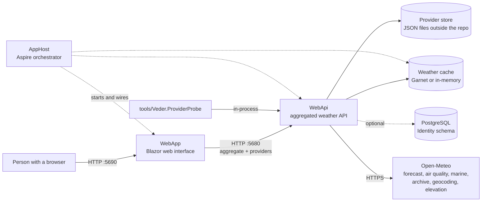
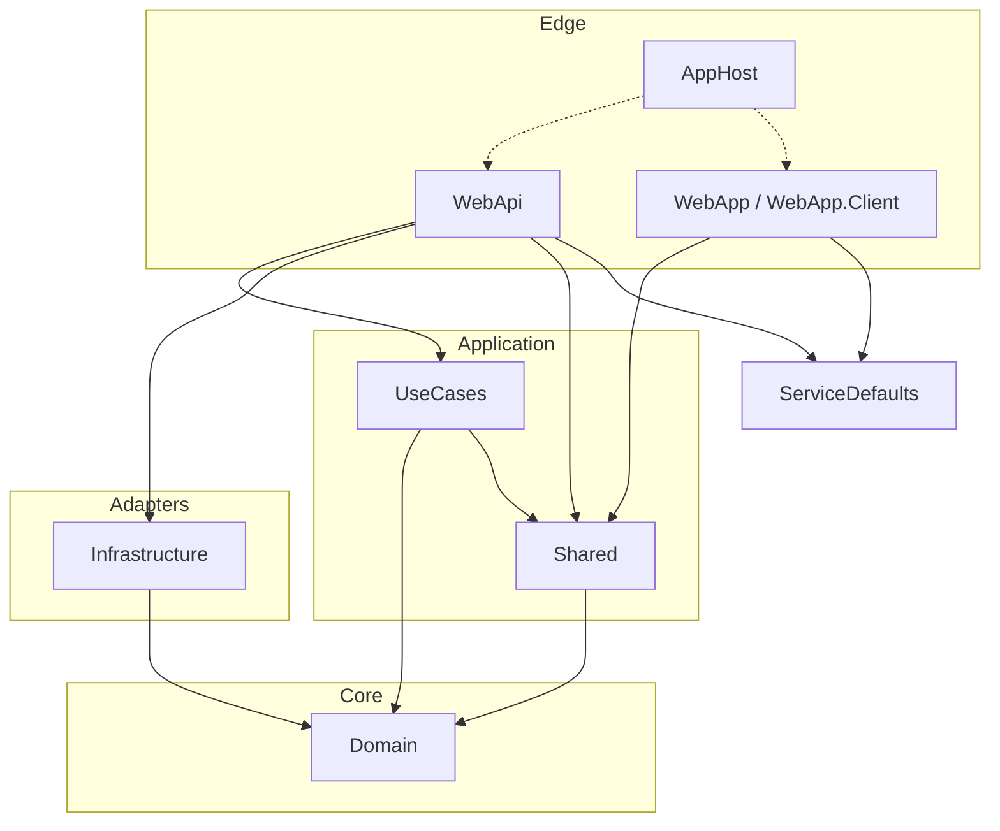
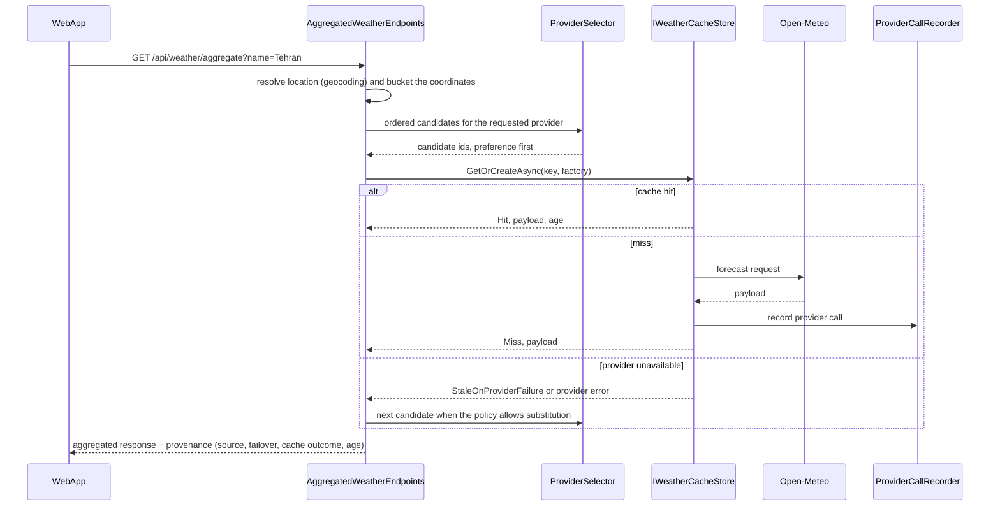

# Architecture

What the system is, which parts exist, how they talk to each other, and where the boundaries are.
Component names here match the names in the code so a reader can jump straight from a diagram to the
file that implements it.

- [1. Purpose and scope](#1-purpose-and-scope)
- [2. System context](#2-system-context)
- [3. Layers and dependency direction](#3-layers-and-dependency-direction)
- [4. Components](#4-components)
- [5. Key interfaces](#5-key-interfaces)
- [6. Data flow: one aggregated request](#6-data-flow-one-aggregated-request)
- [7. Data flow: provider accounting](#7-data-flow-provider-accounting)
- [8. Caching model](#8-caching-model)
- [9. Failure and substitution model](#9-failure-and-substitution-model)
- [10. Runtime and deployment topology](#10-runtime-and-deployment-topology)
- [11. Cross-cutting concerns](#11-cross-cutting-concerns)
- [12. Boundaries and known limitations](#12-boundaries-and-known-limitations)

---

## 1. Purpose and scope

Veder answers a single question well: **what is the weather here, and where did that answer come
from?** One HTTP call returns current conditions, a daily outlook and air quality for a place, and
carries a provenance block naming the provider that actually served it, whether that provider was
substituted, and how stale the reading is.

Explicitly in scope: provider abstraction and selection, a geo-aware cache, aggregated read
endpoints, an optional accounts layer, and a web interface.

Explicitly out of scope today: writing weather data back to providers, alerting, publishing a
hosted documentation site, and multi-region deployment.

## 2. System context

The dashed edges are development-time orchestration and the optional accounts layer; neither is
required for a weather reading to succeed.

## 3. Layers and dependency direction

Dependencies point inward. `Domain` knows nothing about HTTP, storage or providers; `WebApi` and
`WebApp` are edges that may know about everything.

A rule with teeth: **`Domain` has no package references except a legacy specification helper** (see
the `NU1701` note in [stack.md](stack.md#known-constraints)). Provider adapters, storage and Identity
all live in `Infrastructure` behind interfaces declared in `Domain`.

## 4. Components

| Component | Location | Responsibility |
| --- | --- | --- |
| Domain model | `Domain/Entities`, `Domain/ValueObjects` | `WeatherForecast`, `WeatherSeries`, `GeoLocation`, `ProviderCallRecord`, `ProviderDiagnostics`, `ObservationRecord`, `ProviderCredentialMetadata` |
| Caching rules | `Domain/Caching` | `GeoBucketer`, `WeatherCacheKey`, `CacheTtlPolicy`, `ProviderFailurePolicy`, `IWeatherCacheStore` |
| Provider contracts | `Domain/Entities/Interfaces` | `IWeatherProvider`, `IWeatherSeriesProvider`, and the capability interfaces (`IGeocodingProvider`, `IElevationProvider`, `IMarineWeatherProvider`, `IEnsembleWeatherProvider`, `IClimateProjectionProvider`, `IFloodForecastProvider`, `IAirPollutionProvider`) |
| Application cases | `UseCases/Cases`, `UseCases/Handlers` | Commands and queries over the domain, dispatched with Cortex.Mediator, with pipeline behaviours for cross-cutting logic |
| Provider registry | `Infrastructure/Providers/ProviderRegistry.cs` | Knows which providers exist, their capabilities and priority order |
| Provider selector | `Infrastructure/Providers/ProviderSelector.cs` | Chooses a provider for a request, honouring preference and health |
| Open-Meteo adapter | `Infrastructure/Providers/OpenMeteo` | Wire layer: endpoints, request builder, response parsers, mapper, telemetry, exposed through `OpenMeteoWeatherProvider`, `OpenMeteoAirQualityProvider`, `OpenMeteoExtendedProvider` |
| Call accounting | `Infrastructure/Providers/ProviderCallRecorder.cs`, `ProviderConcurrencyGate.cs` | Records every provider call; enforces a per-process concurrency limit |
| Cache implementation | `Infrastructure/Caching/InMemoryWeatherCacheStore.cs` | Single-flight de-duplication, stale-on-failure grace, prefix invalidation, counters |
| Persistence | `Infrastructure/Persistence` | JSON record stores (`Json/*`) under a configurable root, the DPAPI/AES credential vault (`Credentials/ProtectedCredentialStore.cs`), and an in-memory saved-location repository |
| Identity | `Infrastructure/Identity/VederIdentityDbContext.cs` | EF Core `IdentityDbContext` in PostgreSQL schema `identity`, with its own migrations history table |
| Aggregated API | `WebApi/Endpoints/AggregatedWeatherEndpoints.cs` | The single endpoint the UI reads; composes the response and the provenance block |
| Provider admin API | `WebApi/Endpoints/ProvidersEndpoints.cs` | Lists providers with capabilities, priority and health |
| Detailed weather API | `WebApi/Endpoints/WeatherEndpoints.cs` | Capability-scoped endpoints: forecast, air quality, marine, ensemble, climate, flood, elevation, geocoding |
| Identity endpoints | `WebApi/Identity/IdentityRegistration.cs` | Registered only when a connection string exists; returns 401/403 for `/api` instead of redirecting |
| Web interface | `WebApp/Components` | Pages, layout, and the `ProvenanceChip`/`StateBlock` primitives; `WebApp/Routing/PlaceRoute.cs` defines the canonical URL shape |
| Orchestration | `AppHost/AppHost.cs` | Declares Garnet, MongoDB, the API and the UI, and the references between them |
| Service defaults | `ServiceDefaults/Extensions.cs` | Service discovery, standard resilience handler, health checks, OpenTelemetry for every host |
| Provider probe | `tools/Veder.ProviderProbe` | Operator tool: exercises every provider capability through the product's own code path |

## 5. Key interfaces

| Interface | Declared in | Implemented by | Purpose |
| --- | --- | --- | --- |
| `IWeatherProvider` | `Domain/Entities/Interfaces` | `OpenMeteoWeatherProvider` | Current conditions and daily forecast |
| `IWeatherSeriesProvider` | `Domain/Entities/Interfaces` | `OpenMeteoWeatherProvider` | Hourly series rather than a single point in time |
| Capability interfaces | `Domain/Entities/Interfaces` | `OpenMeteoExtendedProvider`, `OpenMeteoAirQualityProvider` | Geocoding, elevation, marine, ensemble, climate, flood, air pollution — each provider implements only what it can do |
| `IWeatherCacheStore` | `Domain/Caching/IWeatherCacheStore.cs` | `InMemoryWeatherCacheStore` | Get-or-create with outcomes: Hit, Miss, Coalesced, StaleOnProviderFailure, Failed, Bypassed |
| `IProviderCallRecordStore` | `Domain/Entities/Interfaces` | `JsonProviderCallRecordStore` | Durable record of provider calls |
| `IProviderDiagnosticsStore` | `Domain/Entities/Interfaces` | `JsonProviderDiagnosticsStore` | Durable provider health and diagnostics |
| `IObservationStore` | `Domain/Entities/Interfaces` | `JsonObservationStore` | Idempotent observations, keyed by `provider\|kind\|bucket\|observedAt` |
| `IProviderCredentialStore` | `Domain/Entities/Interfaces` | `ProtectedCredentialStore` | Add, rotate and revoke credentials without a redeploy; only a fingerprint and suffix are stored in clear text |
| `IGeocodingProvider` | `Domain/Entities/Interfaces` | `OpenMeteoExtendedProvider` | Place name → coordinates, used by `/api/weather/aggregate?name=` |

## 6. Data flow: one aggregated request

`GET /api/weather/aggregate?name=Tehran` (or `?lat=&lon=`), optionally `providerId`, `strictProvider`,
`includeAirQuality`:

Three properties matter here and are enforced in code:

1. **The cache key contains the provider.** A payload answered by one provider is never stored under
   another provider's key, so a failover cannot poison the cache.
2. **Substitution is explicit.** The response records `requestedProvider`, `sourceProvider`,
   `failover` and `degraded`, so a substituted answer is never presented as if it were the first
   choice.
3. **`strictProvider=true` turns substitution into a failure.** The caller gets `503` with a reason
   instead of a different provider's answer.

## 7. Data flow: provider accounting

Every provider call and every observation is written to the provider store, which lives **outside the
repository** (`%LOCALAPPDATA%\Veder\provider-store` by default, `VEDER_PROVIDER_STORE` to override).
Each kind of record is an append-only JSON file with a manifest; observations are idempotent by
construction because the identifier is `provider|kind|bucket|observedAt`, so re-recording the same
observation replaces rather than duplicates it.

Credentials follow the same principle: the vault stores the secret protected (DPAPI on Windows,
AES-256-GCM elsewhere) and keeps only a fingerprint and suffix in clear text, which is what the admin
endpoints can safely return. The tool to exercise this without the UI is
`tools/Veder.ProviderProbe` (`credentials set|rotate|revoke|status`, `observations`).

## 8. Caching model

| Concern | Rule | Where |
| --- | --- | --- |
| Location identity | Coordinates are floored to a grid cell (default `0.02°`, minimum `0.005°`) plus a neighbourhood lookup, and longitudes wrap at ±180° | `Domain/Caching/GeoBucket.cs` |
| Polar handling | Above `75°` latitude the cell widens, because meridians converge | `GeoBucket.PolarLatitudeThreshold` |
| Key shape | `WeatherCacheKey.Compose` with the provider **inside** the key and a unit separator that cannot appear in a rounded value | `Domain/Caching/WeatherCacheKey.cs` |
| Freshness | Current 7 min, air quality 45 min, forecast and marine 4 h, archive 24 h, elevation and geocoding 30 days, each with ±10 % jitter | `CacheTtlPolicy.For` |
| Stampede | Single-flight per key: concurrent misses wait for one upstream call and report `Coalesced` | `InMemoryWeatherCacheStore` |
| Provider outage | A stale entry may be served inside its grace window and is labelled `StaleOnProviderFailure` | `InMemoryWeatherCacheStore` |
| Telemetry | Aggregated counters everywhere; full-fidelity events only for miss, eviction, failure and fallback — recording every hit is not viable at request rates | `InMemoryWeatherCacheStore` |

## 9. Failure and substitution model

Failures are classified once, in `Domain/Caching/ProviderFailurePolicy.cs`, and that classification
drives both health and substitution:

| Failure kind | Affects provider health | Allows substitution |
| --- | --- | --- |
| Availability, timeout, rate limited, malformed response | Yes | Yes |
| Authentication, invalid request, unsupported capability | No | No |

Substitution additionally requires `MaySubstitute(requestedProviderId, strictProvider, kind)`, which
is where `strictProvider` is honoured. Health is tracked **per provider**, never globally: one
provider's inland marine 404 must not degrade an unrelated provider's forecast.

## 10. Runtime and deployment topology

**Local development, orchestrated (recommended).** `dotnet run --project AppHost` starts Garnet,
MongoDB, the API and the UI. `AppHost` publishes endpoints and the UI resolves the API through
service discovery using the logical name `api` (`https+http://api`); the UI logs which strategy it
used at startup, so "which API am I talking to" is never a guess.

**Local development, standalone.** Two processes: the API on `5680` and the UI on `5690`, with
`ApiBaseUrl` telling the UI where the API is. This is the path in the
[quickstart](../README.md#quickstart) and it needs no container runtime.

**Why ports are chosen deliberately.** On Windows, listen ports can fall inside an OS-excluded TCP
range; binding them fails with `SocketException (10013)` and the host dies after printing its startup
banner. `5199` — used during early development — sits inside such a range on the development machine.
`5680`/`5690` were chosen to be outside it, `tools/check-ports.ps1` fails loudly if a needed port
becomes excluded, and the full analysis is in
[runbook-startup-and-ports.md](runbook-startup-and-ports.md).

**Production** is not described here because it does not exist yet; the goal is that the same
containers the AppHost provisions are the ones a deployment would run, and that nothing depends on a
hard-coded port.

## 11. Cross-cutting concerns

- **Health**: `AddServiceDefaults` registers a `self` liveness check; `MapDefaultEndpoints` maps
  `/health` (all checks) and `/alive` (the `live` tag) in Development.
- **Resilience**: every outbound `HttpClient` gets `AddStandardResilienceHandler` — retries with
  exponential back-off and jitter, honouring `Retry-After`, a 15 s attempt and 60 s total timeout, and
  a 30 s circuit breaker. `ProviderConcurrencyGate` adds a per-process concurrency limit.
- **Telemetry**: OpenTelemetry traces and metrics with an OTLP exporter when
  `OTEL_EXPORTER_OTLP_ENDPOINT` is set; the Aspire dashboard consumes it in development. Provider
  calls additionally produce `OpenMeteoTelemetry` events.
- **Logging**: Serilog in the API; structured messages, and the UI logs its resolved API address.
- **Secrets**: DPAPI/AES credential vault plus environment/user-secrets for connection strings. No
  credential value is committed — the development database password was removed from tracked
  configuration and documented for rotation.

## 12. Boundaries and known limitations

| Limitation | Effect | Recorded in |
| --- | --- | --- |
| MongoDB is declared by `AppHost` but consumed nowhere yet | The container starts but the API ignores it; durable storage is JSON files | [decisions/0004](decisions/0004-storage-choices.md) |
| An unknown place returns 200 + empty state (soft 404) | Search engines may index non-existent places | [decisions/0005](decisions/0005-url-scheme.md) |
| Tracked file names are lowercase in places (`veder.tests.csproj`) while the solution references PascalCase | Windows builds; a case-sensitive filesystem does not | [decisions/0006](decisions/0006-portability-and-naming.md) |
| The cache is in-process | A second API instance does not share cache entries; the Redis/Garnet path exists but the store implementation is in-memory | This document, §8 |
| `Domain` still references the legacy `Specification 1.0.1` package | Ten `NU1701` warnings on every build | [stack.md](stack.md#known-constraints) |
| The WebAssembly render mode is declared but no page uses it | The `WebApp.Client` project is dead weight until a page opts in | [decisions/0005](decisions/0005-url-scheme.md) |

## See also

- [stack.md](stack.md) — what each dependency is for
- [repository-structure.md](repository-structure.md) — every directory mapped
- [setup.md](setup.md) — configuration reference and run instructions
- [decisions/](decisions/) — why the choices above were made
- [providers/open-meteo.md](providers/open-meteo.md) — the provider capability matrix
